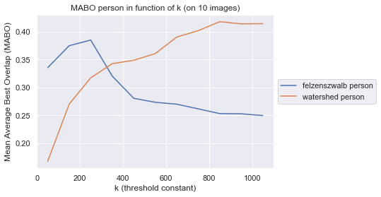
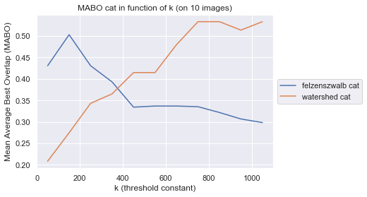

# M1-PJI

2023 - Master 1 Machine Learning - PJI

# Author

```
Name : Stevenson Pather
Email : stevenson.pather.etu@univ-lille.fr
```
# Supervisor

* Deise Santana Maia, Assistant Associate Professor IUT A​, University of Lille

# Report

French only for the moment.

* [REPORT.pdf](./REPORT.pdf)

# Dataset

* [Pascal VOC 2012 Dataset](https://www.kaggle.com/datasets/gopalbhattrai/pascal-voc-2012-dataset)

# Felzenszwalb segmentation resources

* [Ghassem Alaee : pegbis](https://github.com/salaee/pegbis)
* [Pedro F. Felzenszwalb : Efficient Graph-Based Image Segmentation](https://cs.brown.edu/people/pfelzens/papers/seg-ijcv.pdf)
* [J.R.R. Uijlings, K.E.A. van de Sande, T. Gevers, and A.W.M. Smeulders : Selective Search for Object Recognition](http://www.huppelen.nl/publications/selectiveSearchDraft.pdf)

# Watershed segmentation resources

* [Higra python lib](https://higra.readthedocs.io/en/stable/notebooks.html)
* [Jean Cousty, Laurent Najman, Yukiko Kenmochi, Silvio Guimarães : Hierarchical segmentations with graphs](https://hal.science/hal-01344727/document)

# Install dependencies

```bash
$ make lib
```
To start : [install_lib.sh](./install_lib.sh)

If you get an cv2.ximgproc ImportError during experiments with watershed method :
 1. uninstall opencv-python : pip uninstall opencv-python
 2. then install opencv-contrib-python : pip install opencv-contrib-python

# Generate documentation

We use [sphinx](https://www.sphinx-doc.org/) for the documentation of our code.

```bash
$ make doc
```

# main.py usage

## Arguments

* input_path : image path to segment (ex: ../data/VOC2012_train_val/JPEGImages/person/XXXX.jpg")
* category   : category of bounding box (ex: person, cat, bicycle, chair, ...)
* n_comp     : only for watershed method, number of larger regions to retain in the hierachy, default 9 for the 10 most larger regions
* gt_path    : path of the associated groundtruth wit the given input image, optional if you use VOC2012 dataset file tree (../data/VOC2012_train_val/Annotations/category/XXXX.xml)

## Felzenszwalb

```bash
src/$ python main.py [input_path] f [category] [gt_path]
```

with default value for sigma, k, min_size (cf. src/main.py kwargs arg of segmentation function)

## Watershed

```bash
src/$ python main.py [input_path] w [category] [n_comp] [gt_path]
```

# Results :  Felzenszwalb vs Watershed

You can find the experiments loop (long executing time) to obtain this results in the notebook : [src/main.ipynb](./src/main.ipynb)

We measure the Mean Average Best Overlap (MABO) then we average over multiple images for each methods to compare the quality of segmentations. [(cf. Selective Search for Object Recognition 5. Evaluation)](http://www.huppelen.nl/publications/selectiveSearchDraft.pdf)

We take the number of regions obtained with Felzenszwalb segmentations for each k as the number of regions to retain in the watershed hierachy.




